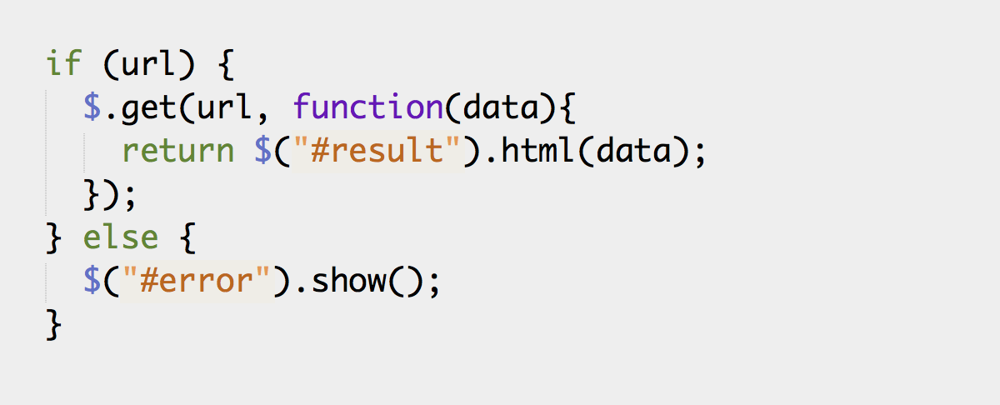
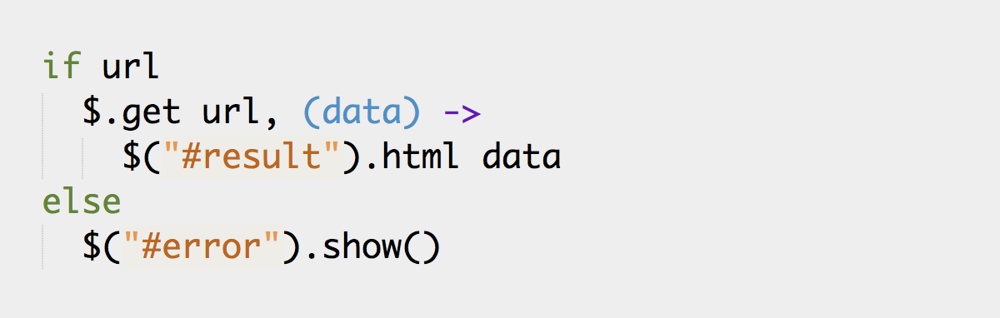
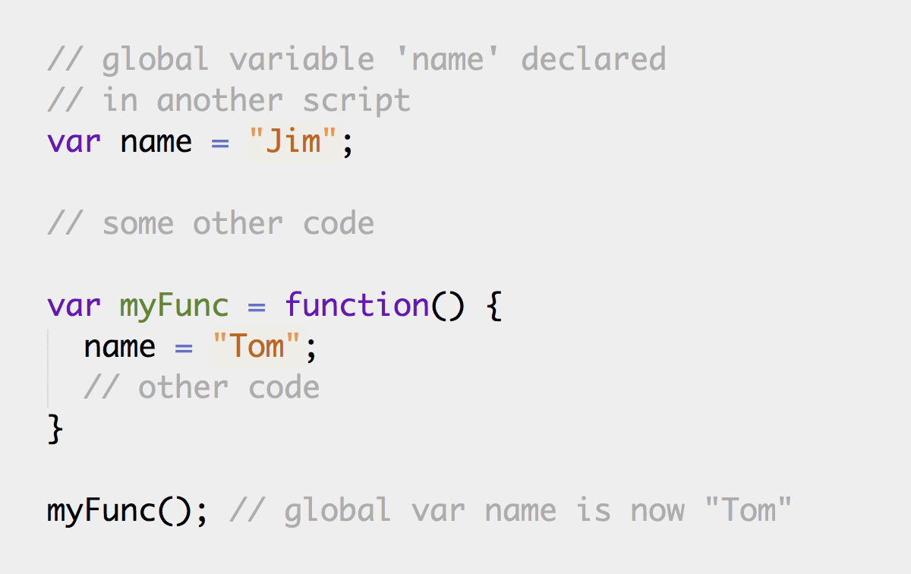
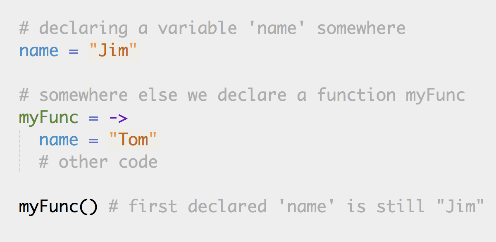
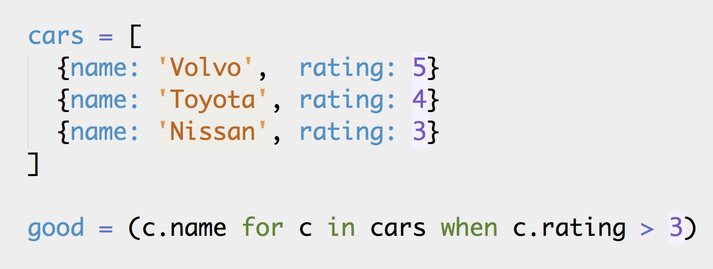

# CoffeeScript
By Jøran Lillesand and Eirik Lied

## Intro

JavaScript is gaining ever more popularity. New frameworks are popping up right and left and single page apps are emerging as a standard on the web. But still, a lot of developers struggle with doing _The Right Thing_ in JavaScript. So much so, that the book JavaScript: The Good Parts, on how to use, and more importantly how not to use, JavaScript is regarded as a must-read for developers getting started with the language.

So, how did this happen? How did we end up with a "language of the web" which is widely regarded to be, plainly put, a rather quirky language? At the time of Javascript's creation, there was quite a lot of hype surrounding Java in the browser (really!). JavaScript's designer, Brendan Eich of Netscape, was ordered to create a scripting language adapted for the browser based on LiveScript – and to make it "Javaish." This way, we ended up with a language intended for simple web-scripting, which today is used in large mission-critical applications. That kinda looks like Java. But at the same time is nothing like Java.

Enter CoffeeScript. CoffeeScript is one of several languages to emerge the recent years that compile into JavaScript. It is described as "a little language that compiles into JavaScript." CoffeeScript lends features and syntax from popular languages such as Python and Ruby, giving programmers the opportunity to write more idiomatic and expressive code.

## Why use CoffeeScript?
The primary reason for choosing CoffeeScript over JavaScript is the improved syntax. CoffeeScript provides a large
collection of neat features that allows us to write code that focus on what we want to achieve,
rather than how we want to achieve it. The result is code that is easier to both read and write.

CoffeeScript compiles to plain old JavaScript. This means that it seamlessly works with jQuery, Backbone.js,
Underscore.js and the existing JavaScript code in your project. Introducing CoffeeScript to an existing JavaScript
codebase is completely viable.

The CoffeeScript compiler produces pretty-printed JavaScript that passes through the JavaScript lint syntax checker
and validator. This means that the output produced by CoffeeScript is likely to behave identically across different
browsers and browser versions and you avoid weird bugs caused by misplaced semicolons,
array iteration, accidental global scoping and so on.

## What's great about CoffeeScript?
Finally time for some code! The following sections show a few of the features CoffeeScript brings to the table.

### It's JavaScript

One of the great features of CoffeeScript is that it compiles down to fully readable JavaScript. And because it's just JavaScript, it works seamlessly with existing JavaScript frameworks like jQuery and your legacy JavaScript code.

Example of trivial use of jQuery:

### Readability 

A drawback with JavaScript is all its parentheses and curly braces, because they can really affect the conciseness and readability of the code. In CoffeeScript, just like in Python, indentation is significant. This helps us remove a lot of those unnecessary characters. Just look at the following JavaScript code:

In CoffeeScript the same can be written as:

It's not too difficult to see that the CoffeeScript code has less noise and makes it easier to see what's going on once you get used to the syntax.

### Automatic scoping of variables

When declaring variables in JavaScript you must always be aware of the scope you declare the variable in. See the code below:

When running the function `myFunc`, the variable `name` exists in the global scope since we did not write the keyword `var` first.

In CoffeeScript you never have to use `var`. CoffeeScript automatically adds the `var` keyword for you when compiling to JavaScript, so writing the following in CoffeeScript will not override any variables:

If you want to overwrite variables or assign them to the global scope in CoffeeScript, you will have to do so explicitly.

### Suffixable operators

CoffeeScript lets you suffix `if` and `unless` operators so that logical expressions can be read much like a regular sentence.

### Comprehensions

Looping over an array or an object's properties is fundamental, and enhancing it really improves the expressiveness in a language. In regular JavaScript you would typically use an old fashioned for-loop. Underscore.js and jQuery offer functions that can improve the syntax quite a bit, but you still end up with parentheses and curly braces all over the place. CoffeeScript has this functionality built into the language.

Consider the JavaScript code below, where we loop through and array and extract the names of the cars with a high rating. 

This is one of the places CoffeeScript really shines. Not only is the corresponding code for looping over the cars short, but its really concise. 

### Classes

Implementing object orientation with prototypes in JavaScript can be a bit cumbersome. CoffeeScript makes it way easier. Using the `class`-keyword we can easily create classes with inheritance and instantiate them:

## Maturity

CoffeeScript has been gaining strong momentum the last few years. Out of more than 2700 respondents in the annual
JavaScript Developer Survey, almost 25% of respondents state that they use CoffeeScript.

CoffeeScript is heavily backed in the Ruby on Rails community. It has been the standard client framework language as of version 3.1, which was released in August 2011. Among other users are GitHub, who state in their
implementation guidelines that all new in-house client code must be written in CoffeeScript.

In Norway, both of our projects in different parts of Posten Norge allow and encourage CoffeeScript used as a client side language.

In terms of adoption and maturity, you will not be alone in using CoffeeScript for your production code. Others
also rely heavily upon it!

## Drawbacks

There are some drawbacks to introducing a new language in your project.

First, there is the cost of knowledge. Each time you introduce a new technology, it represents another skill your team will need to maintain over time. In this case, the cost shouldn't be too bad. CoffeeScript is similar to JavaScript, and in any case, you may choose to compile it to JavaScript and maintain it as such.

The use of a debugger is more difficult when developing with a compiled language, as you will be debugging the compiled code. There are ongoing initiatives to develop a source mapper for CoffeeScript, which will allow debugging CoffeeScript's directly, but to date, nothing has yet been released.

Lastly, you will need to find a way to fit CoffeeScript into your build process. Depending on your platform, there are several tools available for this.
For Java, this can be solved quite easily with tools such as wro4j and JAWR. For .NET both SquishIt.CoffeeScript and Mindscape Web Workbench are good choices.

## Conclusion
As with any new technology there are trade-offs to consider if you want to introduce CoffeeScript into your project.
While it can be argued that CoffeeScript is pretty much like JavaScript, only simpler in most aspects, it will be another tool that your developers will have to master.
We feel that this is an investment that will pay off over time. In the long run you will have more expressive code that will be easier to understand and maintain – and a lot of fun to write!